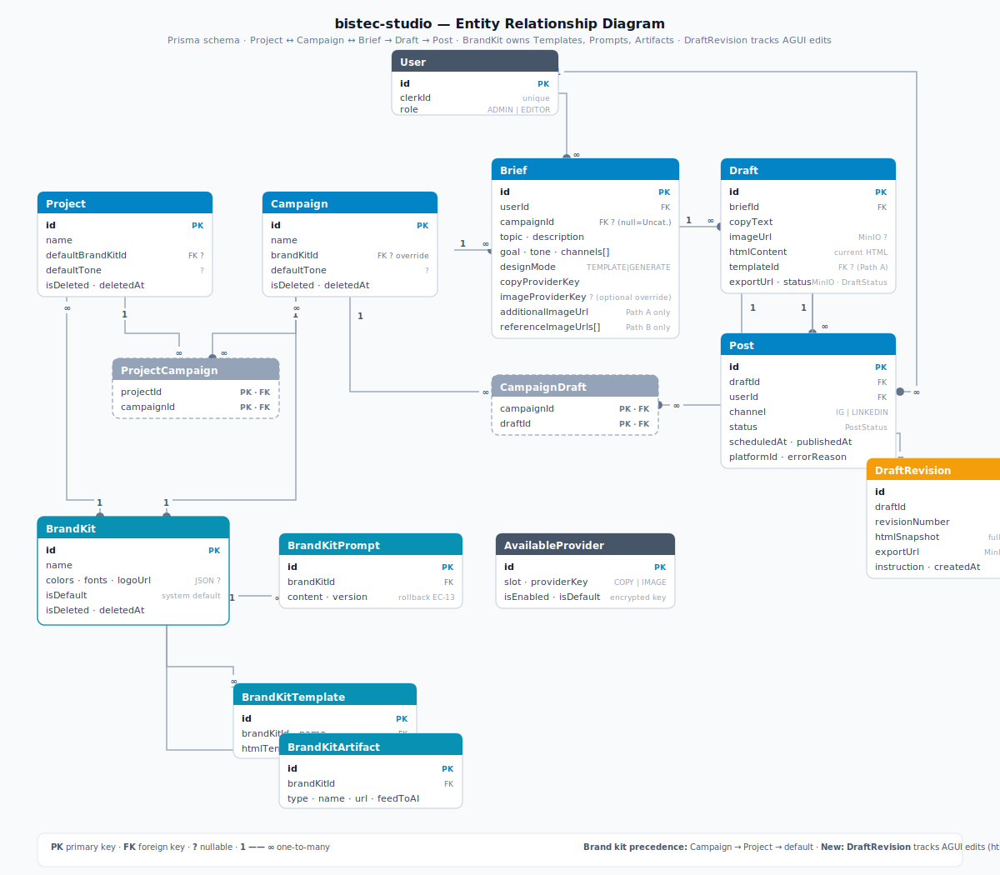

# Design: Marketing Post Studio (v1)

**Change:** marketing-post-studio-v1
**Created:** 2026-06-12

## Technical Approach

A Next.js 14 (App Router) + TypeScript monolith deployed to a VPS via Docker Compose.
Server-side logic runs in Next.js API routes (Route Handlers). All AI provider calls
are server-side only. The browser never calls an AI API directly.

The central architectural principle is the **AI Provider Abstraction Layer**: the
frontend calls stable internal API routes and never references any specific AI model
or third-party service. Adding or swapping an AI model over time = adding a new
provider implementation in `src/providers/` and updating an environment variable or
admin config. No frontend changes, no API contract changes.

Design generation is handled by a **Claude design agent harness**: a standard
Anthropic SDK tool-use loop running server-side in `src/lib/agent/designAgent.ts`.
Claude generates HTML/CSS for social media posts and calls tools (`generateImage`,
`renderHtml`, `getBrandKitContext`) as part of the loop. **Puppeteer** (headless
Chromium, `puppeteer-core` + `chromium-min`) renders the final HTML to a PNG server-side.
No external design services are required at runtime.

## Architecture

### Layer diagram

```
┌─────────────────────────────────────────────────────────────┐
│  Browser (Next.js App Router — React, no AI calls)          │
└───────────────────────┬─────────────────────────────────────┘
                        │  stable internal API routes
┌───────────────────────▼─────────────────────────────────────┐
│  Next.js API Route Handlers  (src/app/api/**)               │
│  - /api/generate/copy         - /api/design/assemble        │
│  - /api/generate/image        - /api/publish                │
│  - /api/drafts/[id]/refine    - /api/schedule               │
└───────────────────────┬─────────────────────────────────────┘
                        │  resolved by provider registry
┌───────────────────────▼─────────────────────────────────────┐
│  AI Provider Abstraction Layer  (src/providers/)            │
│                                                              │
│  interfaces/                                                 │
│    CopyProvider     { generateCopy(brief): Copy }           │
│    ImageProvider    { generateImage(brief): ImageResult }   │
│    DesignOrchestrator { orchestrate(brief, kit): Result }   │
│                                                              │
│  implementations/                                            │
│    copy/openai.ts            ← GPT-4o mini (Path A default) │
│    image/openai.ts           ← gpt-image-2                  │
│    orchestrator/claude-html.ts ← Claude agent + Puppeteer   │
│    orchestrator/claude-cli.ts  ← CLI proxy (test/no API key)│
│    [future: copy/anthropic.ts, image/stability.ts, ...]     │
│                                                              │
│  registry.ts   ← resolves active provider from config       │
└──────────┬────────────────┬────────────────────────────────┘
           │                │
┌──────────▼──────┐  ┌──────▼──────────────────────────────┐
│  OpenAI API     │  │  Claude Design Agent Harness         │
│  (copy, image)  │  │  src/lib/agent/designAgent.ts        │
└─────────────────┘  │                                      │
                     │  Tools:                              │
                     │    generateImage(prompt, brandKitId) │
                     │    renderHtml(html, w, h)            │
                     │    getBrandKitContext(briefId)        │
                     └──────────────┬──────────────────────┘
                                    │
                          ┌─────────▼──────────────┐
                          │  Puppeteer Renderer     │
                          │  src/lib/renderer/      │
                          │  puppeteer.ts           │
                          │  headless Chromium      │
                          │  HTML → PNG buffer      │
                          └─────────────────────────┘

┌─────────────────────────────────────────────────────────────┐
│  Publishing Layer  (src/lib/social/)                        │
│  - instagram.ts   (Instagram Graph API)                     │
│  - linkedin.ts    (LinkedIn API)                            │
└─────────────────────────────────────────────────────────────┘

┌─────────────────────────────────────────────────────────────┐
│  Scheduler  (Docker container — cron worker, every minute)  │
│  Polls DB for due scheduled posts → calls publish layer     │
└─────────────────────────────────────────────────────────────┘

┌─────────────────────────────────────────────────────────────┐
│  Persistence                                                │
│  PostgreSQL (Docker container, Prisma ORM)                  │
│  MinIO      (Docker container, S3-compatible object store)  │
│  Secrets    (.env file on VPS, chmod 600, never in git)     │
└─────────────────────────────────────────────────────────────┘
```

### AI Provider Abstraction — extensibility detail

**Copy and image providers are user-selectable at brief time** from an
admin-curated list. The design orchestrator remains env-configured (infrastructure
choice, not user-facing).

Provider resolution order for copy + image slots:
1. **Brief's chosen provider** — stored on the Brief record, passed to the route handler
2. **System default** — the `AvailableProvider` row marked `isDefault=true` for that slot
3. **Env var fallback** — `COPY_PROVIDER` / `IMAGE_PROVIDER` (used only if DB has no config)

Adding a new model (e.g. Gemini for image generation):
1. Create `src/providers/implementations/image/gemini.ts` implementing `ImageProvider`
2. Register it in `src/providers/registry.ts` under the key `"gemini"`
3. Admin enables it in the settings UI → it appears in the brief UI for all users immediately

The frontend, API route contracts, and database schema for business data are untouched.
Only `AvailableProvider` rows change when models are added/removed.

### Design paths (Path A vs Path B)

**Path A — Preset template:**
```
POST /api/generate/copy   → CopyProvider.generateCopy(brief)
POST /api/design/assemble?mode=template
  → resolve BrandKit (campaign → project → system default)
  → load BrandKitTemplate.htmlTemplate
  → launch Claude design agent (designAgent.ts):
      system prompt: "fill this HTML template with the provided content"
      tools: generateImage, renderHtml, getBrandKitContext
      context: htmlTemplate + brief + copyText + brand kit (colors, fonts, logoUrl)
      Claude fills/adapts the template; calls generateImage tool if raster imagery is needed
        → calls renderHtml → Puppeteer → PNG → MinIO
  → returns { draftId, exportUrl, htmlContent }
```

**Path B — Freeform AI-generated design:**
```
POST /api/design/assemble?mode=generate
  → resolve BrandKit (campaign → project → system default)
  → launch Claude design agent (designAgent.ts):
      system prompt: "design a complete HTML/CSS social media post from scratch"
      tools: generateImage, renderHtml, getBrandKitContext
      context: brief (topic, description, goal, tone, channels)
               + briefImages[] ({ url, intent: "embed" | "reference" })
                 — "embed" images must appear in the HTML layout via 
                 — "reference" images are compositional inspiration only
               + referenceTemplateHtml? (htmlTemplate of the chosen BrandKitTemplate,
                 with a "style inspiration, not a template to fill" instruction)
               + brand kit (colors, fonts, logoUrl, voicePrompt)
      Claude generates HTML/CSS:
        — embeds "embed" images in the layout
        — uses "reference" images for compositional guidance only
        — uses referenceTemplateHtml as loose style inspiration if provided
        — calls generateImage if additional raster imagery is needed
        → calls renderHtml → Puppeteer → PNG → MinIO
  → returns { draftId, exportUrl, htmlContent }
```

### Claude Design Agent Harness

`src/lib/agent/designAgent.ts` — standard Anthropic SDK tool-use loop:

```typescript
async function runDesignAgent(options: DesignAgentOptions): Promise<DesignAgentResult>
```

Tools available to the agent:

```typescript
generateImage(prompt: string, brandKitId: string): Promise<{ imageUrl: string }>
// calls resolved ImageProvider, uploads result to MinIO generated-images bucket

renderHtml(html: string, width: number, height: number): Promise<{ exportUrl: string }>
// calls Puppeteer renderer, uploads PNG to MinIO exported-designs bucket
// returns pre-signed URL for preview

getBrandKitContext(briefId: string): Promise<BrandKitContext>
// resolves campaign → project → default brand kit
// returns { colors, fonts, logoUrl, voicePrompt, feedToAIArtifactUrls }
```

Agent loop (standard Anthropic SDK tool-use pattern):
1. Build messages: system prompt + user message (brief + template/mode context)
2. POST to Anthropic API with tools array + max_tokens
3. If response contains `tool_use` blocks: execute each tool, append `tool_result`
4. Repeat until response contains no `tool_use` blocks
5. Extract final HTML from last text response
6. Hard limit: 15 tool calls per run (EC-12 equivalent)

`src/lib/agent/tools.ts` — tool implementations for the agent loop.

`src/lib/renderer/puppeteer.ts`:

```typescript
async function renderHtmlToPng(html: string, width: number, height: number): Promise<Buffer>
// Uses puppeteer-core + chromium-min
// deviceScaleFactor: 2 → 2160×2160 → downsampled to 1080×1080 square (all platforms)
// page.setContent(html, { waitUntil: 'networkidle0' })
// Returns PNG buffer — caller uploads to MinIO
```

`src/providers/implementations/orchestrator/claude-html.ts` — `DesignOrchestrator`
implementation that wraps `runDesignAgent`. Called by `POST /api/design/assemble`.

### Test mode — `DESIGN_PROVIDER=cli`

When `DESIGN_PROVIDER=cli` is set in `.env`, the provider registry resolves
`ClaudeCliOrchestrator` (`src/providers/implementations/orchestrator/claude-cli.ts`)
instead of the production `ClaudeHtmlOrchestrator`. This allows the full
app stack to be exercised without an Anthropic API key — using the authenticated
Claude Code CLI session on the host machine instead.

**How it works:**

```typescript
// claude-cli.ts — implements DesignOrchestrator
import { execFile } from "child_process"
import { promisify } from "util"

const exec = promisify(execFile)

export class ClaudeCliOrchestrator implements DesignOrchestrator {
  async orchestrate(brief: Brief, brandKitId: string) {
    const prompt = buildCliPrompt(brief, brandKitId)
    const { stdout } = await exec("claude", ["-p", prompt])
    const html = extractHtmlBlock(stdout)  // parse first ```html...``` block
    return {
      htmlContent: html,
      exportUrl: "",   // Puppeteer skipped in CLI mode — no PNG rendered
    }
  }
}
```

**What works in CLI mode vs. production:**

| Capability | Production (`claude-html`) | CLI proxy (`claude-cli`) |
|---|---|---|
| Claude generates HTML | Yes | Yes |
| Tool-use loop (up to 15 calls) | Yes | No — single-shot call |
| `renderHtml` → Puppeteer → PNG | Yes | No — `exportUrl` is empty |
| `generateImage` tool | Yes | No |
| Brand kit context passed | Yes | Yes (in prompt string) |
| MinIO upload | Yes | No |
| API key required | Yes (`sk-ant-*`) | No |
| Good for testing | Full pipeline | UI flow + copy/HTML output |

**Env var:** `DESIGN_PROVIDER=cli` in `.env` (or `.env.local` for local dev).
The registry checks this only for the orchestrator slot — copy and image providers
are unaffected and still require their respective keys.

**`.env.example` entry:**
```
# Set to "cli" to use Claude Code CLI proxy for design generation (no API key required).
# Omit or set to "claude-html" for production.
DESIGN_PROVIDER=claude-html
```

**Limitation — no PNG preview:** in CLI mode `exportUrl` is empty, so the draft
page preview will show a placeholder. The generated `htmlContent` is still saved to
the DB and can be inspected directly. Puppeteer rendering can be layered back in
separately if needed for local testing without a MinIO instance.

---

### AGUI refinement

`POST /api/drafts/[id]/refine` — Claude agent receives `draft.htmlContent` + the
user's natural language instruction, updates the HTML, calls `renderHtml` to produce
a new PNG, and creates a `DraftRevision` row with `htmlSnapshot` and `exportUrl` for
the undo panel. The route checks brand kit compliance before applying edits; if the
instruction conflicts, it returns a reply explaining the conflict without modifying
the draft.

`POST /api/drafts/[id]/revisions/[rev]/restore` — re-renders the stored `htmlSnapshot`
via Puppeteer, stores the result as a new `exportUrl` on the draft, and creates a new
`DraftRevision` row so the undo chain remains linear.

### Frontend design system

The UI follows the **Frozen Light** design system, fully documented in
`docs/ui-reference/DESIGN_SYSTEM.md` (with a working HTML reference and
dark/light screenshots in `docs/ui-reference/`). Glassmorphic aesthetic,
ice-blue accents, Inter + JetBrains Mono.

- **Dark + light themes are mandatory.** Tailwind `darkMode: "class"`; the
  `ThemeProvider` follows OS `prefers-color-scheme` on first visit and persists
  the user's manual toggle to `localStorage`. An inline pre-paint script sets
  the class before first paint to avoid FOUC.
- **Self-hosted fonts/icons** — no external CDN at runtime (consistent with the
  self-contained VPS posture). Inter + JetBrains Mono via `next/font`; icons via
  a local Material Symbols subset or `lucide-react`.
- The design is a **starting point** — tokens and glass aesthetic are the default,
  with room to deviate where a screen needs it (denser library grids, data tables).
- T25 scaffolds the theme config + base components before any screen task; all
  UI tasks depend on it.

### Auth

**Clerk** for authentication (managed provider — fastest path, supports social + email,
avoids building JWT/session from scratch). Two roles stored as Clerk metadata: `admin`
and `editor`. Middleware enforces auth on all routes. Publish/schedule actions check
role server-side in the route handler.

Rationale for Clerk over Entra ID: Entra requires Microsoft 365 tenant setup and
app registration which adds external dependencies before the app is running. Clerk
is self-contained, free tier covers the team size, and can be replaced later by
implementing a new auth adapter if Entra becomes a requirement.

### Database (Prisma + PostgreSQL)

**PostgreSQL running as a Docker container** on the VPS (data persisted via a named Docker volume).
ORM: **Prisma** (type-safe, migrations built-in, works with Next.js edge runtime).

**Entity relationship diagram:** [`docs/erd.svg`](../../../docs/erd.svg) — visual
overview of all entities, the two M:N join tables (ProjectCampaign,
CampaignDraft), and the content pipeline Project → Campaign → Brief → Draft → Post.



Schema:

```prisma
model User {
  id        String    @id @default(cuid())
  clerkId   String    @unique
  role      Role      @default(EDITOR)
  briefs    Brief[]
  posts     Post[]
  createdAt DateTime  @default(now())
}

enum Role { ADMIN EDITOR }

model Project {
  id                String            @id @default(cuid())
  name              String
  defaultBrandKitId String?           // FK → BrandKit (optional)
  defaultBrandKit   BrandKit?         @relation("ProjectBrandKit", fields: [defaultBrandKitId], references: [id])
  defaultTone       String?
  isDeleted         Boolean           @default(false)
  deletedAt         DateTime?
  createdAt         DateTime          @default(now())
  campaigns         ProjectCampaign[]
}

model Campaign {
  id           String            @id @default(cuid())
  name         String
  brandKitId   String?           // FK → BrandKit, overrides project default if set
  brandKit     BrandKit?         @relation("CampaignBrandKit", fields: [brandKitId], references: [id])
  defaultTone  String?           // overrides project default if set
  isDeleted    Boolean           @default(false)
  deletedAt    DateTime?
  createdAt    DateTime          @default(now())
  projects     ProjectCampaign[]
  briefs       Brief[]
  drafts       CampaignDraft[]
}

// M2M: Campaign ↔ Project
model ProjectCampaign {
  projectId  String
  campaignId String
  project    Project  @relation(fields: [projectId], references: [id])
  campaign   Campaign @relation(fields: [campaignId], references: [id])

  @@id([projectId, campaignId])
}

// M2M: Campaign ↔ Draft (shared asset — same export linked to many campaigns)
model CampaignDraft {
  campaignId String
  draftId    String
  campaign   Campaign @relation(fields: [campaignId], references: [id])
  draft      Draft    @relation(fields: [draftId], references: [id])

  @@id([campaignId, draftId])
}

model Brief {
  id               String     @id @default(cuid())
  userId           String
  user             User       @relation(fields: [userId], references: [id])
  campaignId       String?    // null = Uncategorized
  campaign         Campaign?  @relation(fields: [campaignId], references: [id])
  topic            String
  goal             String
  tone             String
  channels         String[]   // ["instagram", "linkedin"]
  designMode            DesignMode
  copyProviderKey       String     // e.g. "openai" — user's choice at brief time
  imageProviderKey      String?    // preferred image provider if Claude calls generateImage; null = system default
  additionalImageUrl    String?    // Path A only — MinIO URL of user-uploaded image for a specific template slot
  briefImages           Json?      // Path B only — { url: string, intent: "embed" | "reference" }[]
                                   //   "embed"     → Claude places this image in the HTML layout via 
                                   //   "reference" → Claude uses it for compositional inspiration only
  referenceTemplateId   String?    // Path B only — FK → BrandKitTemplate; passed to Claude as style inspiration
  referenceTemplate     BrandKitTemplate? @relation("BriefReferenceTemplate", fields: [referenceTemplateId], references: [id])
  createdAt             DateTime   @default(now())
  drafts                Draft[]
}

enum DesignMode { TEMPLATE GENERATE }

model Draft {
  id          String          @id @default(cuid())
  briefId     String
  brief       Brief           @relation(fields: [briefId], references: [id])
  copyText    String
  imageUrl    String?         // MinIO URL from last generateImage tool call (null if Claude used CSS/SVG instead)
  htmlContent      String?         @db.Text  // current HTML/CSS design state (updated on each refinement)
  templateId       String?
  exportUrl        String?         // MinIO URL of rendered PNG
  pendingConflict  Json?           // { conflictId, instruction, explanation } — set when last refine returned a brand kit conflict; cleared on next instruction or cancel
  status           DraftStatus     @default(IN_PROGRESS)
  createdAt   DateTime        @default(now())
  posts       Post[]
  revisions   DraftRevision[]
  campaigns   CampaignDraft[] // shared asset links
}

enum DraftStatus { IN_PROGRESS EXPORTED PUBLISHED FAILED }

model Post {
  id          String     @id @default(cuid())
  draftId     String
  draft       Draft      @relation(fields: [draftId], references: [id])
  userId      String
  user        User       @relation(fields: [userId], references: [id])
  channel     Channel
  status      PostStatus @default(PENDING)
  scheduledAt DateTime?
  publishedAt DateTime?
  platformId  String?    // ID/URL from the social platform
  errorReason String?
  createdAt   DateTime   @default(now())
}

enum Channel { INSTAGRAM LINKEDIN }
enum PostStatus { PENDING SCHEDULED PUBLISHED FAILED CANCELLED }

// A BrandKit is a first-class entity (admin-managed). It owns the brand voice
// (versioned system prompt), structured brand data (colors, fonts, logo), and
// a list of HTML/CSS templates. Projects and Campaigns reference a BrandKit.
model BrandKit {
  id        String              @id @default(cuid())
  name      String
  colors    Json?               // string[] — hex palette e.g. ["#0A1628","#1E3A5F","#00D4FF"]
  fonts     Json?               // {name: string, url: string}[] — MinIO font URLs
  logoUrl   String?             // MinIO URL of primary brand logo
  isDefault Boolean             @default(false)  // system global default (one per system)
  isDeleted Boolean             @default(false)
  deletedAt DateTime?
  createdAt DateTime            @default(now())
  prompts   BrandKitPrompt[]
  artifacts BrandKitArtifact[]
  templates BrandKitTemplate[]
  projects  Project[]           @relation("ProjectBrandKit")
  campaigns Campaign[]          @relation("CampaignBrandKit")
}

// HTML/CSS brand template registered against a BrandKit by an admin.
// Admins upload or paste a template string in the settings UI.
// Users pick from these in the brief wizard (Path A only).
model BrandKitTemplate {
  id           String   @id @default(cuid())
  brandKitId   String
  brandKit     BrandKit @relation(fields: [brandKitId], references: [id])
  name         String   // display name shown in brief picker
  htmlTemplate String   @db.Text  // base HTML/CSS template with content slots
  createdAt    DateTime @default(now())
  referencedByBriefs Brief[] @relation("BriefReferenceTemplate")  // Path B style-reference back-relation
}

// Versioned brand voice / system prompt — prepended to Path B design agent system prompt.
// History retained so an admin can roll back to a prior version (EC-13).
model BrandKitPrompt {
  id         String   @id @default(cuid())
  brandKitId String
  brandKit   BrandKit @relation(fields: [brandKitId], references: [id])
  content    String
  version    Int      @default(1)
  isActive   Boolean  @default(false)
  createdBy  String   // userId
  createdAt  DateTime @default(now())

  @@unique([brandKitId, version])
}

// Brand assets stored in MinIO. Artifacts with feedToAI=true are passed to the
// Claude design agent (Path B) and image generation as brand context.
model BrandKitArtifact {
  id         String       @id @default(cuid())
  brandKitId String
  brandKit   BrandKit     @relation(fields: [brandKitId], references: [id])
  type       ArtifactType // LOGO | FONT | COLOR | REFERENCE_IMAGE | EXAMPLE_POST | OTHER
  name       String
  url        String       // MinIO object URL
  feedToAI   Boolean      @default(false)
  createdAt  DateTime     @default(now())
}

enum ArtifactType { LOGO FONT COLOR REFERENCE_IMAGE EXAMPLE_POST OTHER }

// Admin-curated list of models available to users per slot.
// Admins register providers from the UI — key auto-identified by prefix where possible.
model AvailableProvider {
  id               String       @id @default(cuid())
  slot             ProviderSlot // COPY | IMAGE
  providerKey      String       // e.g. "openai", "gemini", "anthropic"
  providerName     String       // e.g. "Anthropic", "OpenAI" — auto-detected or admin-specified
  label            String       // display name in brief UI, e.g. "Claude 3.5 Sonnet"
  keyPrefix        String       // first 8 chars of key for UI display, e.g. "sk-ant-a"
  encryptedApiKey  String       // AES-256-GCM encrypted API key
  isEnabled        Boolean      @default(true)
  isDefault        Boolean      @default(false) // system default for this slot
  createdAt        DateTime     @default(now())

  @@unique([slot, providerKey])
  @@unique([slot, isDefault]) // only one default per slot (enforced in app logic)
}

enum ProviderSlot { COPY IMAGE }

// Records each committed AGUI refinement for undo support.
model DraftRevision {
  id             String   @id @default(cuid())
  draftId        String
  draft          Draft    @relation(fields: [draftId], references: [id])
  revisionNumber Int      // monotonically increasing per draft
  instruction    String   // the user's natural language instruction that produced this revision
  htmlSnapshot   String   @db.Text  // HTML/CSS snapshot after this edit (for undo re-render)
  exportUrl      String?  // MinIO URL of PNG at this revision (for preview in undo panel)
  createdAt      DateTime @default(now())

  @@unique([draftId, revisionNumber])
}
```

### Asset storage

**MinIO** (S3-compatible object storage, Docker container on VPS) — two buckets:
- `generated-images` — raster images from on-demand `generateImage` tool calls (temp, 7-day lifecycle rule)
- `exported-designs` — Puppeteer-rendered PNG assets (permanent, linked in Draft.exportUrl)

Images are uploaded server-side via the AWS S3 SDK (MinIO is S3-compatible); only
object URLs are stored in the DB. No binary blobs in the database.

MinIO is accessed via its internal Docker network hostname (`minio:9000`) from the
app container. A separate MinIO Console port (9001) is exposed for admin use only,
bound to `127.0.0.1` on the VPS (not publicly accessible).

Pre-signed URLs are used for serving assets to the browser — the MinIO port is
never directly exposed to the public internet.

### Scheduler

**Dedicated Docker container** (defined in `docker-compose.yml` as the `scheduler`
service, runs `src/scheduler/worker.ts` on a 60-second polling loop) — a standalone
Node.js script that:
1. Queries DB for `Post WHERE status=SCHEDULED AND scheduledAt <= now()`
2. For each, calls the publish layer
3. Updates status to PUBLISHED or FAILED with reason
4. Idempotency: marks post as IN_FLIGHT before publish, clears on completion/failure
   to prevent duplicate publish on overlapping runs (EC-7)

Scheduling window: ±2 minutes of target time (job runs every minute, max one missed
cycle before catch-up).

### Secrets management

All third-party credentials are provided as environment variables via a `.env` file
on the VPS. Security protocols:

- `.env` is **never committed to git** — enforced by `.gitignore` (`.env*` pattern,
  with `.env.example` the only exception)
- File permissions: `chmod 600 .env`, owned by the user running Docker Compose
- No secrets appear in `docker-compose.yml` — the compose file references
  `env_file: .env` and never hard-codes values
- Secret rotation: update `.env` → `docker compose up -d` to restart affected
  containers (no full redeploy needed)
- `.env.example` documents every required variable with placeholder values and
  inline comments explaining the source of each secret — committed to git as the
  canonical setup reference
- Social API tokens (Instagram, LinkedIn) are stored in the database **encrypted
  at rest** using a `TOKEN_ENCRYPTION_KEY` env var (AES-256-GCM) — the raw token
  never sits in plaintext in the DB

## UI Reference

A static prototype (`bistec-studio-proto/`) and its page outline (`docs/prototype-pages.md`) guided the original frontend build and were **removed 2026-06-23** once every page shipped. The implemented app under `src/app/(app)/` is now the page-structure reference; the design system lives in `docs/ui-reference/`.

---

## File Changes Map

| File / Directory | Action | Description |
|---|---|---|
| `src/app/` | create | Next.js App Router pages |
| `src/app/api/generate/copy/route.ts` | create | Copy generation endpoint |
| `src/app/api/generate/image/route.ts` | create | Image generation endpoint |
| `src/app/api/design/assemble/route.ts` | create | Design assembly (Path A + B) — launches Claude design agent |
| `src/app/api/design/export/route.ts` | create | Re-render export (thin wrapper; Puppeteer runs at assembly time) |
| `src/app/api/publish/route.ts` | create | Immediate publish |
| `src/app/api/schedule/route.ts` | create | Schedule a post |
| `src/app/api/posts/route.ts` | create | List/cancel scheduled posts |
| `src/app/api/projects/route.ts` | create | Project CRUD |
| `src/app/api/projects/[id]/route.ts` | create | Project update / soft-delete / recover |
| `src/app/api/campaigns/route.ts` | create | Campaign CRUD |
| `src/app/api/campaigns/[id]/route.ts` | create | Campaign update / soft-delete / recover |
| `src/app/api/campaigns/[id]/projects/route.ts` | create | Campaign → project reassignment (admin) |
| `src/app/api/campaigns/[id]/drafts/[draftId]/route.ts` | create | Link draft to campaign (shared asset) |
| `src/app/api/campaigns/[id]/brandkit/route.ts` | create | Resolved brand kit for a campaign |
| `src/app/api/library/route.ts` | create | Asset library + publish history (filterable by project/campaign) |
| `src/app/api/admin/brandkits/route.ts` | create | BrandKit CRUD (admin) |
| `src/app/api/admin/brandkits/[id]/route.ts` | create | BrandKit update / soft-delete / set default (admin) |
| `src/app/api/admin/brandkits/[id]/prompt/route.ts` | create | BrandKit prompt versions: list, add, activate (rollback) (admin) |
| `src/app/api/admin/brandkits/[id]/artifacts/route.ts` | create | BrandKit artifact upload to MinIO / list / delete (admin) |
| `src/app/api/admin/brandkits/[id]/templates/route.ts` | create | HTML template CRUD per brand kit (admin) |
| `src/app/(app)/projects/page.tsx` | create | Projects list UI |
| `src/app/(app)/projects/[id]/page.tsx` | create | Project detail — campaigns + posts |
| `src/app/(app)/campaigns/page.tsx` | create | Campaigns list UI (standalone + project-assigned) |
| `src/app/(app)/campaigns/[id]/page.tsx` | create | Campaign detail — posts |
| `src/providers/interfaces/` | create | CopyProvider, ImageProvider, DesignOrchestrator interfaces |
| `src/providers/implementations/copy/openai.ts` | create | GPT copy provider |
| `src/providers/implementations/image/openai.ts` | create | gpt-image-2 provider |
| `src/providers/implementations/orchestrator/claude-html.ts` | create | DesignOrchestrator impl wrapping designAgent (production) |
| `src/providers/implementations/orchestrator/claude-cli.ts` | create | DesignOrchestrator CLI proxy for test mode — no API key, no Puppeteer |
| `src/providers/registry.ts` | create | Provider resolution from env config |
| `src/lib/agent/designAgent.ts` | create | Claude tool-use agent loop (Anthropic SDK) |
| `src/lib/agent/tools.ts` | create | Tool implementations: generateImage, renderHtml, getBrandKitContext |
| `src/lib/renderer/puppeteer.ts` | create | HTML → PNG renderer (puppeteer-core + chromium-min) |
| `src/lib/social/instagram.ts` | create | Instagram Graph API publisher |
| `src/lib/social/linkedin.ts` | create | LinkedIn API publisher |
| `src/lib/storage/minio.ts` | create | MinIO (S3-compatible) upload / pre-signed URL |
| `src/scheduler/worker.ts` | create | Scheduled post worker |
| `prisma/schema.prisma` | create | Full data model |
| `prisma/migrations/` | create | Auto-generated migrations |
| `tailwind.config.ts` | create | Frozen Light theme tokens (light + dark), `darkMode: "class"` |
| `src/app/globals.css` | create | Glass utility classes, custom scrollbars, self-hosted font faces |
| `src/components/theme/` | create | ThemeProvider (system + localStorage), ThemeToggle, pre-paint FOUC script |
| `src/components/layout/AppShell.tsx` | create | Top app bar + sidebar + fluid canvas layout |
| `src/components/ui/` | create | Base components: Button, GlassPanel, GlassInput, Select, SegmentedToggle, StatusChip |
| `src/middleware.ts` | create | Clerk auth middleware |
| `src/app/(auth)/` | create | Login/signup pages (Clerk components) |
| `src/app/(app)/brief/` | create | Brief creation UI (Path A / B mode select) |
| `src/app/(app)/draft/[id]/` | create | Draft refinement UI |
| `src/app/(app)/library/` | create | Asset library + history |
| `src/app/(app)/admin/settings/` | create | Admin: provider management (with API key registration + auto-detect) + brand kit manager |
| `src/app/api/drafts/[id]/refine/route.ts` | create | AGUI refinement endpoint — Claude agent updates HTML, re-renders, checks brand kit compliance |
| `src/app/api/drafts/[id]/revisions/route.ts` | create | List revisions for undo panel |
| `src/app/api/drafts/[id]/revisions/[rev]/restore/route.ts` | create | Re-render stored htmlSnapshot via Puppeteer |
| `src/components/draft/RefinementPanel.tsx` | create | AGUI chat panel — instruction input, AI reply stream, undo history list |
| `.env.example` | create | Required env vars documented |
| `Dockerfile` | create | Container image (includes chromium-min layer; shared by app + scheduler services) |
| `docker-compose.yml` | create | Orchestrates app, scheduler, postgres, minio containers |
| `.gitignore` | modify | Ensure `.env*` (except `.env.example`) is ignored |

## Data Model Changes

Greenfield — full schema defined above. No existing tables to migrate.

## API Changes

Greenfield — all routes are new. All are authenticated (Clerk session cookie).
Role checks (`requireRole('admin')`) are enforced server-side in route handlers,
not in middleware, so they fail-closed if misconfigured.

Internal API contract summary:

```
POST /api/generate/copy         body: { briefId }                   → { copy: string }
POST /api/generate/image        body: { briefId, prompt? }          → { imageUrl: string }
  // not a pipeline step — called internally by the generateImage agent tool
POST /api/design/assemble       body: { draftId, mode, templateId? } → { draftId, exportUrl, htmlContent }
POST /api/design/export         body: { draftId }                   → { exportUrl: string }
  // re-renders draft.htmlContent via Puppeteer if exportUrl is absent or stale
POST /api/publish               body: { draftId, channels }         → { posts: Post[] }
POST /api/schedule              body: { draftId, channels, scheduledAt } → { posts: Post[] }
DELETE /api/posts/[id]          (cancel scheduled)                  → 204
GET  /api/library               → { drafts[], posts[] }

// Brand kits (admin only)
GET    /api/admin/brandkits                             (admin) → { brandKits: BrandKit[] }  // excludes soft-deleted
POST   /api/admin/brandkits                             (admin) body: { name, colors?, fonts?, logoUrl? } → { brandKit }
PATCH  /api/admin/brandkits/[id]                        (admin) body: { name?, colors?, fonts?, logoUrl?, isDefault? } → { brandKit }
DELETE /api/admin/brandkits/[id]                        (admin) (soft-delete) → 204
GET    /api/admin/brandkits/[id]/templates              (admin) → { templates: BrandKitTemplate[] }
POST   /api/admin/brandkits/[id]/templates              (admin) body: { name, htmlTemplate } → { template }
PATCH  /api/admin/brandkits/[id]/templates/[tid]        (admin) body: { name?, htmlTemplate? } → { template }
DELETE /api/admin/brandkits/[id]/templates/[tid]        (admin) → 204
GET    /api/admin/brandkits/[id]/prompt                 (admin) → { active, versions: BrandKitPrompt[] }
POST   /api/admin/brandkits/[id]/prompt                 (admin) body: { content } → { prompt }   // new version, becomes active
POST   /api/admin/brandkits/[id]/prompt/[v]/activate    (admin) → 204   // rollback (EC-13)
GET    /api/admin/brandkits/[id]/artifacts              (admin) → { artifacts: BrandKitArtifact[] }
POST   /api/admin/brandkits/[id]/artifacts              (admin) body: { type, name, file, feedToAI } → { artifact }  // uploads to MinIO
DELETE /api/admin/brandkits/[id]/artifacts/[aid]        (admin) → 204

GET  /api/admin/providers                 (admin) → { providers: AvailableProvider[] }
POST /api/admin/providers                 (admin) body: { slot, apiKey, providerName?, label } → { provider }
  // apiKey is inspected server-side for known prefixes; providerName/label auto-populated where detected.
  // If prefix unrecognized, providerName + label must be supplied by admin.
  // Key validated against provider API before saving. Only keyPrefix stored in response — never full key.
PATCH /api/admin/providers/[id]           (admin) body: { isEnabled?, isDefault?, label? } → { provider }
DELETE /api/admin/providers/[id]          (admin) → 204  // remove a registered provider
GET  /api/providers/available             (authed) → { copy: Provider[], image: Provider[] }
  // returns only isEnabled=true providers per slot — used to populate brief UI dropdowns

// AGUI refinement
POST /api/drafts/[id]/refine              (authed) body: { instruction: string } → { reply: string, revisionId?: string }
  // Claude agent updates draft.htmlContent, re-renders via Puppeteer, creates DraftRevision row.
  // If instruction conflicts with brand kit: returns { conflict: true, explanation, conflictId } — no edit applied, no revisionId.
  // Client renders a conflict card with Override / Cancel buttons.
  // Override: POST /api/drafts/[id]/refine { conflictId } — backend loads pendingConflict, skips compliance check, applies edit.
  // Cancel: client dismisses card, no request sent. Backend clears pendingConflict on next non-conflict instruction.
GET  /api/drafts/[id]/revisions           (authed) → { revisions: DraftRevision[] }
POST /api/drafts/[id]/revisions/[rev]/restore (authed) → { exportUrl: string }
  // Re-renders stored htmlSnapshot via Puppeteer; updates draft.htmlContent + exportUrl; creates new revision.

// Projects
GET    /api/projects                      → { projects[] }  // excludes soft-deleted
POST   /api/projects                      body: { name, defaultBrandKitId?, defaultTone? } → { project }
PATCH  /api/projects/[id]                 body: { name?, defaultBrandKitId?, defaultTone? } → { project }
DELETE /api/projects/[id]                 (soft-delete) → 204
POST   /api/projects/[id]/recover         → { project }

// Campaigns
GET    /api/campaigns                     → { campaigns[] }  // excludes soft-deleted; ?projectId= to filter
POST   /api/campaigns                     body: { name, brandKitId?, defaultTone?, projectIds? } → { campaign }
PATCH  /api/campaigns/[id]                body: { name?, brandKitId?, defaultTone? } → { campaign }
DELETE /api/campaigns/[id]                (soft-delete) → 204
POST   /api/campaigns/[id]/recover        → { campaign }
PATCH  /api/campaigns/[id]/projects       (admin) body: { projectIds } → { campaign }  // reassign
POST   /api/campaigns/[id]/drafts/[draftId]  → 204  // link a draft to a campaign (shared asset)

// Brand kit resolution (used by brief UI on campaign select)
GET    /api/campaigns/[id]/brandkit       → { brandKit: BrandKit, source: "campaign"|"project"|"default" }
  // resolves the precedence chain and returns the full BrandKit (colors, fonts, logoUrl,
  // active prompt, feedToAI artifacts) so the brief UI can pre-fill brand context
```

## Key Decisions

**1. Provider Abstraction Layer (answers the extensibility question)**
The frontend and API route contracts are permanently decoupled from specific AI
models. The `CopyProvider`, `ImageProvider`, and `DesignOrchestrator` interfaces
are stable. Adding a new model means: implement the interface, register in
`registry.ts`, update one env var. This is the Strategy pattern applied at the
AI integration boundary.

**2. Clerk for auth (over Entra ID SSO)**
Avoids blocking the build on Microsoft tenant/app-registration setup. Clerk's
role metadata (`admin` / `editor`) is sufficient for v1. Migrating to Entra later
only requires replacing the auth adapter — the role-check pattern in route handlers
stays identical.

**3. Prisma + PostgreSQL in Docker (over a managed cloud DB)**
Prisma's type-safe query builder and built-in migration tooling fit a greenfield
Next.js project. PostgreSQL array columns handle `channels: String[]` naturally.
Running PostgreSQL in Docker Compose alongside the app keeps the stack self-contained
on the VPS with zero managed-service cost. Data is persisted via a named Docker volume.

**3b. MinIO for object storage (over Azure Blob / S3)**
MinIO is S3-compatible and self-hosted on the same VPS, eliminating all cloud
provider dependencies. The `@aws-sdk/client-s3` package works against MinIO
without changes — the only difference is the endpoint URL (env var). If the
project ever migrates to AWS S3, only the env vars change.

**4. Puppeteer for HTML→PNG (over html2canvas / node-canvas)**
Puppeteer (headless Chromium) produces browser-identical rendering: CSS gradients,
shadows, clip-paths, custom fonts — all correct. `deviceScaleFactor: 2` gives
retina-quality output at 2160×2160, downsampled to 1080×1080 square for all platforms (Instagram and LinkedIn both use square post format).
html2canvas loses fidelity on modern CSS. node-canvas requires reimplementing a
layout engine. Production screenshot services (Vercel OG, Bannerbear) all use
headless Chrome. `chromium-min` keeps the Docker layer size manageable with
layer caching in the Dockerfile.

**4b. Claude as design agent (tool-use loop)**
Claude runs the full design pipeline as an agent harness (not a single-turn call).
This enables: iterative HTML generation, image generation as a tool call mid-design,
brand kit enforcement via the system prompt, and AGUI refinement as a continuation
of the same agent pattern. The frontend never knows about the agent loop — it just
calls stable API routes. The hard limit of 15 tool calls per run prevents runaway
cost (equivalent of EC-12).

**4b-model. Haiku for Path A, Sonnet for Path B**
The design agent uses different Claude models depending on the generation mode:
- **Path A (template fill)** — `claude-haiku-4-5-20251001`. Template filling is a
  constrained, lower-complexity task: inject copy, embed image URLs, apply brand
  colors. Haiku handles this correctly at ~10× lower cost than Sonnet.
- **Path B (freeform generation)** — `claude-sonnet-4-6`. Designing a complete
  HTML/CSS layout from a brief requires more reasoning capacity — layout decisions,
  brand interpretation, responsive sizing, visual hierarchy. Sonnet's stronger
  instruction-following produces better design output here.
- **AGUI refinement** — uses the same model as the originating path (Haiku for
  template-based drafts, Sonnet for generated drafts), resolved from `brief.designMode`.
- **Brand voice prompt assistance** (generate/improve) — `claude-sonnet-4-6` for
  quality, since these are infrequent admin operations where cost is not a concern.

The model is configured per-mode in `src/lib/agent/designAgent.ts` — no env var or
admin setting needed. A future update can promote Path A to Sonnet if output quality
requires it without any API contract changes.

**4b-testmode. CLI proxy for development without an API key**
Setting `DESIGN_PROVIDER=cli` in `.env` swaps in `ClaudeCliOrchestrator` —
a single-shot `execFile("claude", ["-p", prompt])` call that piggybacks on the
developer's Claude Code CLI session. The tool-use loop, Puppeteer rendering, and
MinIO upload are all bypassed; the orchestrator returns the HTML Claude produces
directly. This lets the full app (auth, brief wizard, DB writes, draft page) be
tested without an `sk-ant-*` key. The production path is restored by removing the
env var or setting `DESIGN_PROVIDER=claude-html`.

**4b-edit. Edit brand kit as a distinct, always-available flow**
The settings UI separates brand kit *creation* from brand kit *editing*. An Edit
button on each kit card opens a modal pre-populated with the kit's current name,
colors, fonts, logoUrl, and linked templates. Prompt
versioning and artifact management remain on the expanded card — they are not part
of the edit modal, keeping each concern in one place. The `PATCH
/api/admin/brandkits/[id]` endpoint handles all editable fields. This separation
means admins can update templates or brand colors at any time without going through
a create flow.

**4b-image. Image generation is on-demand (not a mandatory pipeline pre-step)**
Claude can generate CSS gradients, SVG patterns, and geometric backgrounds natively
in HTML/CSS without calling `generateImage`. The `generateImage` tool is reserved for
designs that genuinely need raster/photographic imagery — Claude decides at runtime.
This avoids unnecessary image generation cost on designs where CSS/SVG backgrounds
produce equal or better visual results, and removes the pre-step latency from every
Path A and Path B run. `Brief.imageProviderKey` becomes optional (`String?`); the
system default image provider is used when Claude does call `generateImage`.
`Draft.imageUrl` is nullable and only set when the agent made at least one
`generateImage` call during that run.

**4c. HTML/CSS templates (over external design tool templates)**
Brand templates are stored as HTML/CSS strings in `BrandKitTemplate.htmlTemplate`.
Claude fills them with content from the brief. Admins upload or paste templates
in the settings UI. No external design tool dependency. Templates are portable,
versionable, and renderable without a third-party service.

**4d. Brand kit structured data (colors, fonts, logoUrl)**
BrandKit now stores `colors[]` (hex palette), `fonts[]` (with MinIO URLs), and
`logoUrl` directly. Claude's system prompt receives these as CSS variables and
asset URLs — Claude uses them to generate on-brand HTML/CSS. This eliminates any
brand kit discovery step at runtime and keeps all brand data self-contained in the
application database.

**4e. AI-assisted brand voice prompt authoring**
The brand voice prompt editor exposes two AI modes powered by Claude (Anthropic SDK):
(a) **Generate** — available when no prompt version exists yet; admin describes the
brand in plain text → Claude drafts a full brand voice prompt → presented for review
before saving as v1. (b) **Improve** — available alongside any existing active
prompt → Claude refines it → presented for review before saving as the next version.
Both modes feed through the existing prompt versioning system (FR-28b), so rollback
always applies. The AI output is never saved automatically — admin must confirm.
Implementation: `POST /api/admin/brandkits/[id]/prompt/generate` (generate) and
`POST /api/admin/brandkits/[id]/prompt/improve` (improve), both admin-gated, both
call Claude with appropriate system + user prompts.

**5. Scheduler as a dedicated Docker container (polling loop)**
The scheduler service in `docker-compose.yml` uses the same Docker image as the
main app, runs `src/scheduler/worker.ts`, and polls every 60 seconds. This shares
the Prisma client and business logic with zero code duplication. Docker Compose
restarts the container automatically on failure (`restart: unless-stopped`).

**6. BrandKit as a first-class entity (owns prompt + artifacts + structured brand data)**
Rather than a free-floating `BrandSystemPrompt` table and raw brand data on
Project/Campaign, a **BrandKit** is a proper entity that Projects and Campaigns
reference by FK. It stores structured brand data (`colors`, `fonts`, `logoUrl`),
a MinIO artifact store (`BrandKitArtifact` rows), and HTML/CSS templates
(`BrandKitTemplate` rows). The brand voice lives in versioned `BrandKitPrompt`
rows — history is retained with an `isActive` flag so an admin can roll back to
any prior version (EC-13). Artifacts flagged `feedToAI` are passed to Path B
design agent and image generation as brand context. BrandKits are **admin-managed**
(brand governance). Brand kit precedence at generation time: Campaign →
Project default → system default (`BrandKit.isDefault = true`).

## Risks & Mitigations

| Risk | Likelihood | Impact | Mitigation |
|---|---|---|---|
| Instagram Graph API app review takes weeks | High | High (blocks AC-3) | Start Meta Business app registration immediately; build and test publish flow with a test account before review completes |
| LinkedIn app publishing permissions gated | Medium | High (blocks AC-3) | Apply for LinkedIn app early; design the publish layer to degrade gracefully (one channel fails, other proceeds) |
| Puppeteer container size (Chromium ~200MB) | Medium | Low | Use `chromium-min` + Docker layer caching; Chromium layer is cached across deploys unless base image changes |
| Claude-generated HTML has layout issues for certain post dimensions | Medium | Medium | `renderHtml` returns dimensions metadata; agent can call `renderHtml` multiple times to iterate; add a post-render dimension validation step |
| Font loading failures in Puppeteer | Low | Medium | All brand fonts served from MinIO absolute URLs; `waitUntil: 'networkidle0'` ensures fonts are loaded before screenshot |
| Path B agent runaway / high token cost | Medium | Medium | Hard limit of 15 tool calls per run; per-user generation budget enforced by NFR-7 |
| MinIO disk fills up on VPS | Low | Medium | Monitor VPS disk usage; 7-day lifecycle rule on `generated-images` bucket auto-deletes temp images; alert if disk > 80% |
| `.env` file leaked via git | Low | High | `.gitignore` enforced; pre-commit hook blocks accidental commit of `.env`; rotate all secrets immediately if leak occurs |
